# Polymarket 原油市场 ↔ 航空股：关联性分析

数据窗口 2024-01-01 → 数据末端　|　生成于 `scripts/11_oil_airline_analysis.py`

## 0. 先说三件必须先知道的事

**（1）「油价水平」市场存在，但只密集报价了二十来个交易日；长样本上能用的只有「供给中断概率」。**

成交额最大的那一批原油市场问的是**地缘供给中断风险**（霍尔木兹海峡封锁、伊朗石油设施被袭），而 OPEC 产量决议这种直接的油价驱动市场累计成交额只有三位数，统计上等于不存在。所以 §2/§3 的主分析检验的是 **「原油供给中断概率」↔ 航空股**，不是「油价预期」↔ 航空股。两者不是一回事：供给风险概率上升同时意味着油价上行压力**与**全局风险偏好下降，后者对航空股也是利空，所以三角验证与剔除大盘不是可选项。

但 Polymarket 上另有一套 **`will-crude-oil-cl-hit-high-K-by-T`** 的行权价阶梯（K = 70…200 美元/桶），它给出的是油价的**隐含分布**，标的直接就是油价水平。代价是它只在 2026 年 3 月那波油价冲击里密集报价，算下来 21 个交易日。这一路单独放在 **§5**，与主分析并列呈现——一个样本长、信号间接，一个信号直接、样本短，**都报，不挑**。

**（2）真正的「盘口」（挂单深度）数据只有 64 天，本分析用的是成交流。**

原始需求里的「盘口数据」指的是订单簿。这份归档里带订单簿的层只覆盖 2026-07-23 → 2026-09-24 共 64 天，做日频相关分析样本太短。因此本分析用成交口径的微观结构代理：成交额加权概率、成交笔数、日内实现波动，以及 **OFI（订单流不平衡 = Σ 方向 × 成交额）**作为方向性压力的代理。这是可得数据下最接近盘口压力的量，但它不是挂单深度，结论表述上不能混。

**（3）横截面只有 6–8 只股票。**

单日横截面 IC 的标准误约 1/√7 ≈ 0.38，单日 IC 基本是纯噪声。日度 IC 序列的**均值**仍是无偏的，但这个 IC 不能与本项目全市场 1500 只股票的 IC 直接比大小。

## 1. 分析对象：哪些市场进来了，为什么

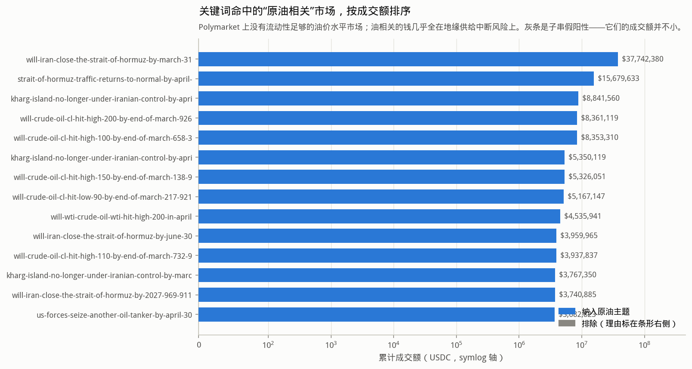

三步筛选（宽召回 → 硬排除 → 人工归类），命中 1445 个市场，纳入 255 个（单市场累计成交额 ≥ 5,000 USDC）。灰条是被排除的子串假阳性，它们的成交额并不小——NHL 埃德蒙顿油人队（**Oil**ers）、加拿大政治人物 P**oil**ievre、英超 **Brent**ford、餐饮公司 Cracker **Barrel**。排除理由逐条写在图上与下表里，可复核。

| condition_id | market_slug | category | category_refined | vol_usdc | included | theme | reason | close_at | resolution_status | neg_risk |
|---|---|---|---|---|---|---|---|---|---|---|
| 0x561cd8d035bac38ed04e23d7882a126da38d7ead9d6679f722ad62c0c9d54ad2 | will-iran-close-the-strait-of-hormuz-by-march-31 | Foreign Policy | Politics | 3.774e+07 | True | supply_risk | 纳入 | 2026-12-31 00:00:00+00:00 | resolved | f |
| 0x924a2942747dd75703321a7c8d809c68f6a514c3b0f2a2e64274e02310634669 | strait-of-hormuz-traffic-returns-to-normal-by-april-30 | Economy | Finance | 1.568e+07 | True | supply_risk | 纳入 | 2026-04-30 00:00:00+00:00 | resolved | f |
| 0xa78ecba9c4273564cce4b810db46bb36cc35db9cd52fc4e067c77f85af1c1048 | kharg-island-no-longer-under-iranian-control-by-april-30-912 | Khamenei | Politics | 8.842e+06 | True | supply_risk | 纳入 | 2026-04-30 23:55:00+00:00 | resolved | f |
| 0x09e8f0db05570a5048fdccdae58a52c608aa6cf640ced2190dcbeb52ce52f491 | will-crude-oil-cl-hit-high-200-by-end-of-march-926 | NYMEX Crude Oil Futures | Finance | 8.361e+06 | True | price_ladder | 纳入 | 2026-03-31 00:00:00+00:00 | resolved | f |
| 0xc5300759dc2089042380795fe7384010a6b6ebdf9e6da7ed3f786d9a5f61c563 | will-crude-oil-cl-hit-high-100-by-end-of-march-658-396-769-971 | NYMEX Crude Oil Futures | Finance | 8.353e+06 | True | price_ladder | 纳入 | 2026-03-31 00:00:00+00:00 | resolved | f |
| 0x10d4b55e87cd8df815a88de7a8eccdff77418d361285a540fbdc6505bb99a4a2 | kharg-island-no-longer-under-iranian-control-by-april-15 | Khamenei | Politics | 5.35e+06 | True | supply_risk | 纳入 | 2026-04-15 23:55:00+00:00 | resolved | f |
| 0x92d2f5f693619c0154d55538a84a3943e787a8ca67907a8e7e5064b0048c83a7 | will-crude-oil-cl-hit-high-150-by-end-of-march-138-937-747 | NYMEX Crude Oil Futures | Finance | 5.326e+06 | True | price_ladder | 纳入 | 2026-03-31 00:00:00+00:00 | resolved | f |
| 0x6c310d728433d9a05226274b29ca4540cb908e4e94bf9795f25c69f9d5a72d70 | will-crude-oil-cl-hit-low-90-by-end-of-march-217-921 | NYMEX Crude Oil Futures | Finance | 5.167e+06 | True | price_ladder | 纳入 | 2026-03-31 00:00:00+00:00 | resolved | f |
| 0x8fe8b0f19001c5d61f186edc1991347a60eda9c5bc096f5f144c13d6cd72de78 | will-wti-crude-oil-wti-hit-high-200-in-april | Finance | Finance | 4.536e+06 | True | price_level | 纳入 | 2026-04-30 00:00:00+00:00 | resolved | f |
| 0x43c7e8f73e867ebc035edf002617f67cf96b90c85eccac18090e553bfe7a8411 | will-iran-close-the-strait-of-hormuz-by-june-30 | Foreign Policy | Politics | 3.96e+06 | True | supply_risk | 纳入 | 2026-06-30 00:00:00+00:00 | resolved | f |
| 0x814657a16a3c5b39834864251372e30f68ddcd0f040c5c6a83a52cddb2c35226 | will-crude-oil-cl-hit-high-110-by-end-of-march-732-945-787-552 | NYMEX Crude Oil Futures | Finance | 3.938e+06 | True | price_ladder | 纳入 | 2026-03-31 00:00:00+00:00 | resolved | f |
| 0x4befb52f7cd2b606c63731ad74e677325ff0ed0f48f1104552a34f0f54619ea3 | kharg-island-no-longer-under-iranian-control-by-march-31 | Khamenei | Politics | 3.767e+06 | True | supply_risk | 纳入 | 2026-03-31 23:55:00+00:00 | resolved | f |
| 0x5bbabd359667d5bbdb9ee690bb959c9aa4cf4b08b2ae6592118a59753f622d78 | will-iran-close-the-strait-of-hormuz-by-2027-969-911-654-431-667 | Foreign Policy | Politics | 3.741e+06 | True | supply_risk | 纳入 | 2026-12-31 00:00:00+00:00 | resolved | f |
| 0x036f32b7b18291ff94d09f0c11830d8b839aafd0148e644207be97a4f9bd5a8a | us-forces-seize-another-oil-tanker-by-april-30 | Geopolitics | Politics | 3.683e+06 | True | supply_risk | 纳入 | 2026-04-30 00:00:00+00:00 | resolved | f |
| 0xb0acc3ef6710e933b96b877c4f74dcf16affb0ce71ce46c68a2de783c211fd3c | energy-infrastructure-ceasefire-in-ukraine-in-march | Breaking News | Politics | 3.604e+06 | True | supply_risk | 纳入 | 2025-03-31 12:00:00+00:00 | resolved | f |
| 0xf64f880b571d7a70d858649d30f0843aa57307e304aeb617349df74ce34d044e | will-crude-oil-cl-hit-high-120-by-end-of-march-766-813-597 | NYMEX Crude Oil Futures | Finance | 3.579e+06 | True | price_ladder | 纳入 | 2026-03-31 00:00:00+00:00 | resolved | f |
| 0xf6890c707d1e327b006b9511bdba8c98ec4e4978646c6ffcf3ec8750c26a666a | will-crude-oil-cl-hit-high-105-by-end-of-march-881 | NYMEX Crude Oil Futures | Finance | 3.498e+06 | True | price_ladder | 纳入 | 2026-03-31 00:00:00+00:00 | resolved | f |
| 0x7eceae72d7d7b3e175fa872c728526e6fec4714288a4bda91fe818e298e69a6f | will-wti-crude-oil-wti-hit-high-120-in-april | Finance | Finance | 3.181e+06 | True | price_level | 纳入 | 2026-04-30 00:00:00+00:00 | resolved | f |
| 0xf6e44da63acf52f67bd2d370468c3ef297f064c50f660370151d6c8f08fd586d | will-crude-oil-cl-hit-high-180-by-end-of-march-692 | NYMEX Crude Oil Futures | Finance | 2.993e+06 | True | price_ladder | 纳入 | 2026-03-31 00:00:00+00:00 | resolved | f |
| 0x8698572ca0243d41683c62f45ccb6ad17b6c90393188d48e54ea47c319ba5c4a | ukraine-strikes-another-tanker-in-black-sea-by-march-31-2026 | Politics | Politics | 2.875e+06 | True | supply_risk | 纳入 | 2026-03-31 00:00:00+00:00 | resolved | f |
| 0x0f4d9792bdf45a5fa5f717cbe55d78107878854816374b2dd741f46062aba2b0 | will-iran-close-the-strait-of-hormuz-before-july | Politics | Politics | 2.764e+06 | True | supply_risk | 纳入 | 2025-06-30 00:00:00+00:00 | resolved | f |
| 0x38f808d62ffb605305310cb866a96c98b535b415ba301ecbd782d73bce10fa40 | will-crude-oil-cl-hit-low-85-by-end-of-march-728-921-637-263 | NYMEX Crude Oil Futures | Finance | 2.539e+06 | True | price_ladder | 纳入 | 2026-03-31 00:00:00+00:00 | resolved | f |
| 0x05ccbc3b7861349dc2fc0ce2c2bca9fd9671675171d7070abdf087ba1d7f085b | will-wti-crude-oil-wti-hit-low-80-in-april-167-519-314-426-955-262-749-894-518-898-344 | Finance | Finance | 2.517e+06 | True | price_level | 纳入 | 2026-04-30 00:00:00+00:00 | resolved | f |
| 0x39104f7f48f4f379de4162f0cf64c24bf1ccb1f786fd7fafb3fbfb879fffedcc | will-wti-crude-oil-wti-hit-high-150-in-april | Finance | Finance | 2.49e+06 | True | price_level | 纳入 | 2026-04-30 00:00:00+00:00 | resolved | f |
| 0xdda7d5017be661e87715a6e9e4933aad8a9231041cc7d5103c11a3fcb14bf292 | will-crude-oil-cl-hit-high-100-by-end-of-june-675-964 | Commodities | Finance | 2.277e+06 | True | price_ladder | 纳入 | 2026-06-30 18:30:00+00:00 | resolved | f |

## 2. A股

截断时刻 07:00 UTC　|　油种基准 布伦特原油　|　信号 659 天，Δp 非缺 339 天

### 2.1 时序对齐

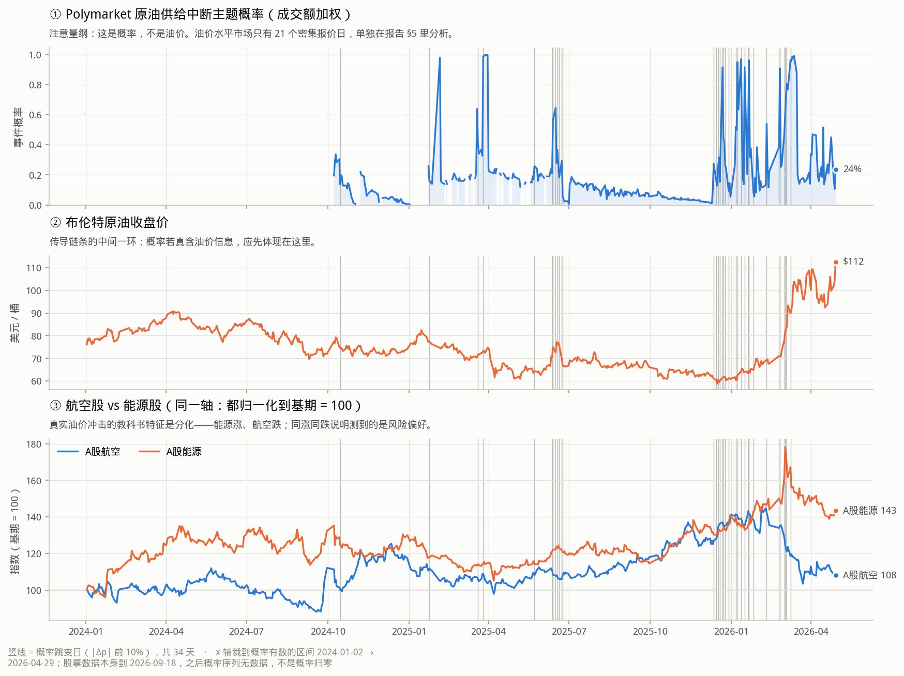

三个分面共享 x 轴、各自保留真实量纲——**刻意不画双 Y 轴**：概率 ∈ [0,1]、油价 ∈ 美元/桶、股价指数三者量纲不同，双轴图的刻度对齐方式由画图的人随手决定，能让同一份数据看起来「高度同步」或「完全无关」。本分析要检验的恰恰是有没有关联，不能用一个会凭手感造出相关性的图去展示它。第三个分面里航空与能源都归一化到基期 = 100，那是同一个单位，所以可以同轴。

### 2.2 领先滞后相关

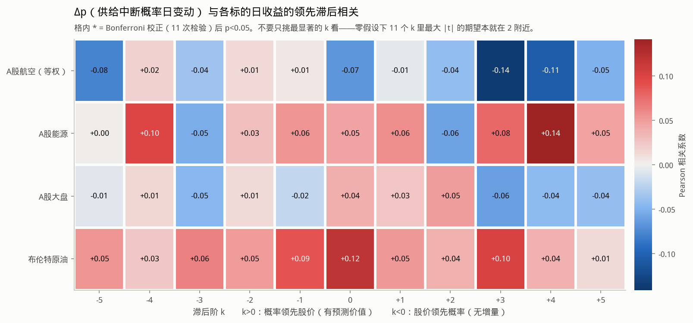

`k>0` 是概率领先股价（有预测价值），`k<0` 是股价领先概率（Polymarket 在跟随股市，无增量）。`*` 是 Bonferroni 校正后 p<0.05。**读法提醒**：扫 11 个 k，零假设下最大 |t| 的期望本就在 2 附近，所以不要挑最显著的 k 报告；要看 k>0 整体形态，以及是否与 k<0 对称（对称 = 同期共动，不是领先）。

| 市场 | 标的 | k | n | pearson | t_NW | p_NW | p_Bonf | spearman |
|---|---|---|---|---|---|---|---|---|
| A股 | A股航空（等权） | 0 | 339 | -0.06656 | -1.299 | 0.194 | 1 | -0.03441 |
| A股 | A股航空（等权） | 1 | 339 | -0.005997 | -0.09728 | 0.9225 | 1 | 0.01601 |
| A股 | A股能源 | 0 | 339 | 0.04725 | 0.6192 | 0.5358 | 1 | 0.06163 |
| A股 | A股能源 | 1 | 339 | 0.05796 | 1.212 | 0.2257 | 1 | -0.02977 |
| A股 | A股大盘 | 0 | 339 | 0.04003 | 1.072 | 0.2838 | 1 | -0.005335 |
| A股 | A股大盘 | 1 | 339 | 0.02594 | 0.7378 | 0.4606 | 1 | 0.0587 |
| A股 | 布伦特原油 | 0 | 332 | 0.1195 | 2.684 | 0.007265 | 0.07992 | 0.04432 |
| A股 | 布伦特原油 | 1 | 332 | 0.05266 | 1.545 | 0.1224 | 1 | 0.07344 |

**主口径结论（Δp → 次日航空股收益）**：不显著（r=-0.006, t=-0.10）；n=339 下 80% 功效的可检出下限 |r|≈0.152，所以这是真的接近零

剔除大盘成分后重算：

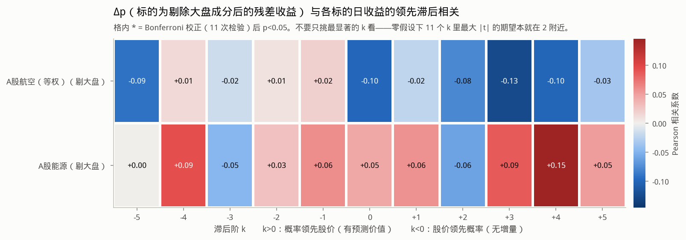

这一张是判别渠道的关键。地缘风险概率上升时大盘本身会跌，航空股跟着跌**不需要**任何油的逻辑。只有剔掉大盘之后航空股仍跌、能源股仍涨，才能说抓到了燃油成本这个渠道。

### 2.3 事件研究

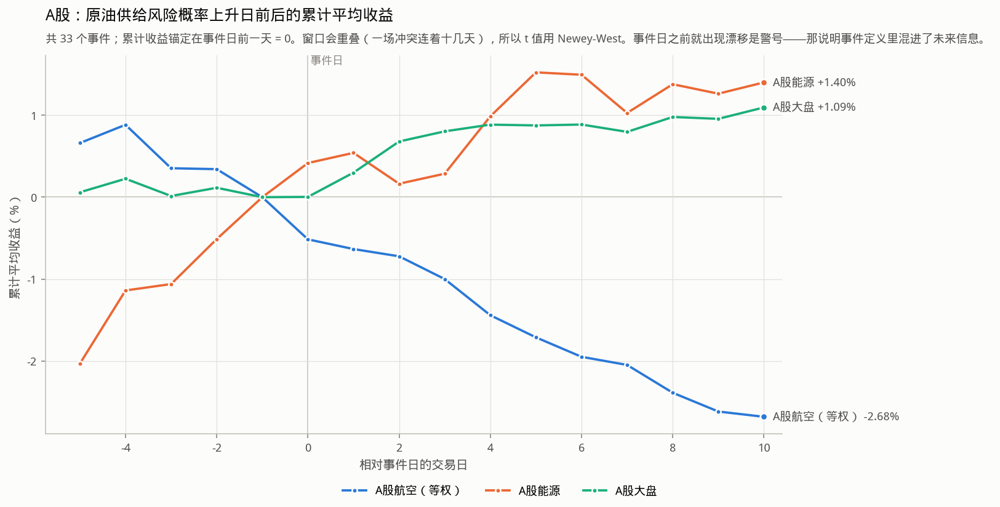

日频相关系数把有消息的日子和 95% 什么都没发生的日子同权平均，这类地缘风险信号本来就集中在少数几天，全样本相关会被稀释到看不见。事件研究只看概率大幅跳变的那些天。

| 方向 | 标的 | 事件数 | 阈值Δp | 事件后累计收益 | t_NW | p_NW |
|---|---|---|---|---|---|---|
| 风险上升 | A股航空（等权） | 33 | 0.03845 | -0.02679 | -1.165 | 0.2439 |
| 风险上升 | A股能源 | 33 | 0.03845 | 0.014 | 0.6953 | 0.4869 |
| 风险上升 | A股大盘 | 33 | 0.03845 | 0.01095 | 1.112 | 0.266 |
| 风险上升 | 布伦特原油 | 33 | 0.03819 | 0.04268 | 1.668 | 0.0954 |
| 风险缓解 | A股航空（等权） | 32 | -0.03131 | 0.004545 | 0.3538 | 0.7235 |
| 风险缓解 | A股能源 | 32 | -0.03131 | 0.006418 | 0.7894 | 0.4299 |
| 风险缓解 | A股大盘 | 32 | -0.03131 | 0.00776 | 0.7305 | 0.4651 |
| 风险缓解 | 布伦特原油 | 32 | -0.03026 | 0.008779 | 0.6142 | 0.5391 |
| 有大消息（不分方向） | A股航空（等权） | 33 | 0.08054 | -0.017 | -0.7645 | 0.4446 |
| 有大消息（不分方向） | A股能源 | 33 | 0.08054 | 0.01769 | 1.081 | 0.2797 |
| 有大消息（不分方向） | A股大盘 | 33 | 0.08054 | 0.0141 | 1.192 | 0.2333 |
| 有大消息（不分方向） | 布伦特原油 | 33 | 0.08 | 0.03046 | 1.158 | 0.2467 |

_事件窗口会重叠（一场冲突连着十几天），所以 t 值用 Newey-West。若曲线在事件日**之前**就出现漂移，那是警号——说明事件定义里混进了未来信息。_

### 2.4 三角验证

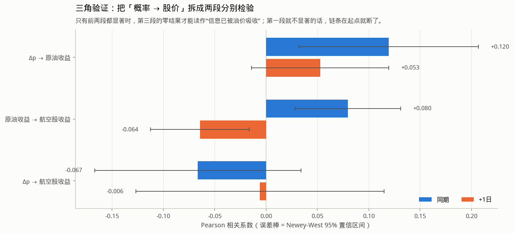

直接检验「概率 → 航空股」有个致命的解释困难：结果为零时分不清是**Polymarket 没信息**还是**燃油成本渠道不通**。所以拆成两段分别验。

| 链路 | 口径 | n | pearson | se_nw | t_nw | p_nw | spearman |
|---|---|---|---|---|---|---|---|
| Δp → 原油收益 | 同期 | 332 | 0.1195 | 0.04452 | 2.684 | 0.007265 | 0.04432 |
| Δp → 原油收益 | +1日 | 332 | 0.05266 | 0.03409 | 1.545 | 0.1224 | 0.07344 |
| 原油收益 → 航空股收益 | 同期 | 2381 | 0.07964 | 0.02618 | 3.042 | 0.002348 | 0.06501 |
| 原油收益 → 航空股收益 | +1日 | 2380 | -0.06446 | 0.02447 | -2.634 | 0.008427 | -0.05382 |
| Δp → 航空股收益 | 同期 | 339 | -0.06656 | 0.05124 | -1.299 | 0.194 | -0.03441 |
| Δp → 航空股收益 | +1日 | 339 | -0.005997 | 0.06165 | -0.09728 | 0.9225 | 0.01601 |

### 2.5 分化检验（主要的伪发现防线）

真实油价冲击的教科书特征是**分化**：能源涨、航空跌，价差走阔。如果 Δp 上升时两者只是同涨同跌，说明测到的是全局风险偏好，不是油价。下表是 `能源收益 − 航空收益` 对 Δp 的相关。

| 口径 | n | pearson | se_nw | t_nw | p_nw | spearman |
|---|---|---|---|---|---|---|
| 同期 | 339 | 0.08274 | 0.08091 | 1.023 | 0.3065 | 0.06346 |
| +1日 | 339 | 0.04516 | 0.05761 | 0.7839 | 0.4331 | -0.02335 |

### 2.6 预测回归（控制大盘）

| 信号 | 标的 | n | beta | t_NW | beta_控制大盘 | t_NW_控制大盘 |
|---|---|---|---|---|---|---|
| dp | A股航空（等权） | 339 | -0.001028 | -0.09728 | -0.001192 | -0.1123 |
| dp | A股能源 | 339 | 0.009922 | 1.212 | 0.009921 | 1.201 |
| dp | A股大盘 | 339 | 0.003704 | 0.7378 | 0.003714 | 0.7365 |
| dp_norm | A股航空（等权） | 276 | -0.0009609 | -1.01 | -0.0009025 | -0.951 |
| dp_norm | A股能源 | 276 | -0.0002345 | -0.1654 | -0.0001943 | -0.1362 |
| dp_norm | A股大盘 | 276 | -0.00039 | -0.5457 | -0.0003336 | -0.4713 |
| ofi_share | A股航空（等权） | 343 | -0.001479 | -0.979 | -0.001506 | -0.9878 |
| ofi_share | A股能源 | 343 | 0.001583 | 1.261 | 0.001527 | 1.211 |
| ofi_share | A股大盘 | 343 | -0.0002842 | -0.2317 | -0.0003398 | -0.2761 |

### 2.7 稳健性：缩尾

主结果**不缩尾**。这里把 Δp 与收益各双侧缩尾 0.5% 后重算：若关联在缩尾后消失，结论要改写成「效应只存在于极端事件日」，而不是报一个全样本相关。

| 标的 | n | pearson | se_nw | t_nw | p_nw | spearman |
|---|---|---|---|---|---|---|
| A股航空（等权） | 339 | -0.01185 | 0.05772 | -0.2053 | 0.8373 | 0.016 |
| A股能源 | 339 | 0.04633 | 0.04891 | 0.9472 | 0.3435 | -0.02978 |
| A股大盘 | 339 | 0.02592 | 0.03675 | 0.7052 | 0.4807 | 0.05871 |
| 布伦特原油 | 332 | 0.05265 | 0.03511 | 1.5 | 0.1337 | 0.07343 |

## 3. 美股

截断时刻 20:00 UTC　|　油种基准 WTI原油　|　信号 684 天，Δp 非缺 354 天

### 3.1 时序对齐

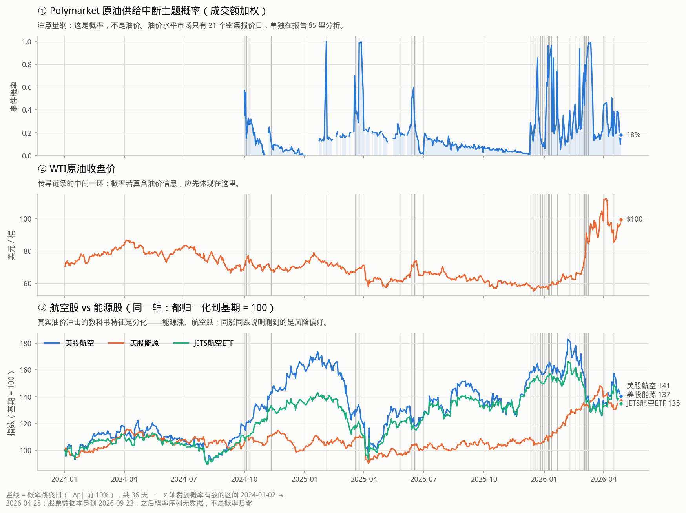

三个分面共享 x 轴、各自保留真实量纲——**刻意不画双 Y 轴**：概率 ∈ [0,1]、油价 ∈ 美元/桶、股价指数三者量纲不同，双轴图的刻度对齐方式由画图的人随手决定，能让同一份数据看起来「高度同步」或「完全无关」。本分析要检验的恰恰是有没有关联，不能用一个会凭手感造出相关性的图去展示它。第三个分面里航空与能源都归一化到基期 = 100，那是同一个单位，所以可以同轴。

### 3.2 领先滞后相关

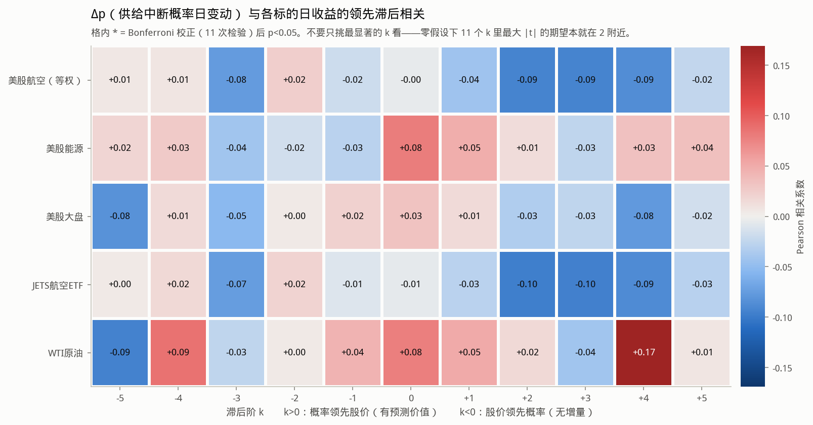

`k>0` 是概率领先股价（有预测价值），`k<0` 是股价领先概率（Polymarket 在跟随股市，无增量）。`*` 是 Bonferroni 校正后 p<0.05。**读法提醒**：扫 11 个 k，零假设下最大 |t| 的期望本就在 2 附近，所以不要挑最显著的 k 报告；要看 k>0 整体形态，以及是否与 k<0 对称（对称 = 同期共动，不是领先）。

| 市场 | 标的 | k | n | pearson | t_NW | p_NW | p_Bonf | spearman |
|---|---|---|---|---|---|---|---|---|
| 美股 | 美股航空（等权） | 0 | 354 | -0.004395 | -0.09726 | 0.9225 | 1 | -0.01387 |
| 美股 | 美股航空（等权） | 1 | 354 | -0.0433 | -1.211 | 0.2261 | 1 | -0.07815 |
| 美股 | 美股能源 | 0 | 353 | 0.08011 | 2.272 | 0.0231 | 0.2541 | 0.1097 |
| 美股 | 美股能源 | 1 | 353 | 0.04828 | 1.133 | 0.2573 | 1 | 0.05875 |
| 美股 | 美股大盘 | 0 | 354 | 0.03184 | 0.9238 | 0.3556 | 1 | -0.006803 |
| 美股 | 美股大盘 | 1 | 354 | 0.01467 | 0.4282 | 0.6685 | 1 | 0.04331 |
| 美股 | JETS航空ETF | 0 | 354 | -0.005451 | -0.1255 | 0.9002 | 1 | -0.03511 |
| 美股 | JETS航空ETF | 1 | 354 | -0.02828 | -0.906 | 0.365 | 1 | -0.059 |
| 美股 | WTI原油 | 0 | 347 | 0.07793 | 1.312 | 0.1895 | 1 | 0.1469 |
| 美股 | WTI原油 | 1 | 346 | 0.05133 | 1.174 | 0.2403 | 1 | 0.001633 |

**主口径结论（Δp → 次日航空股收益）**：不显著（r=-0.043, t=-1.21）；n=354 下 80% 功效的可检出下限 |r|≈0.148，所以这是真的接近零

剔除大盘成分后重算：

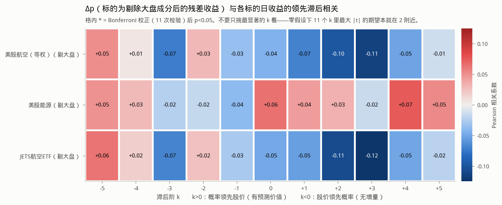

这一张是判别渠道的关键。地缘风险概率上升时大盘本身会跌，航空股跟着跌**不需要**任何油的逻辑。只有剔掉大盘之后航空股仍跌、能源股仍涨，才能说抓到了燃油成本这个渠道。

### 3.3 事件研究

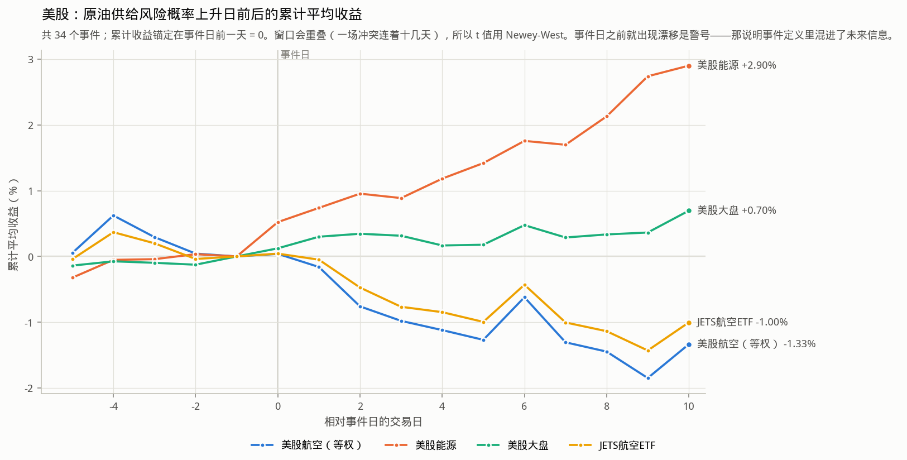

日频相关系数把有消息的日子和 95% 什么都没发生的日子同权平均，这类地缘风险信号本来就集中在少数几天，全样本相关会被稀释到看不见。事件研究只看概率大幅跳变的那些天。

| 方向 | 标的 | 事件数 | 阈值Δp | 事件后累计收益 | t_NW | p_NW |
|---|---|---|---|---|---|---|
| 风险上升 | 美股航空（等权） | 34 | 0.04372 | -0.01335 | -0.6811 | 0.4958 |
| 风险上升 | 美股能源 | 34 | 0.04425 | 0.029 | 2.702 | 0.006897 |
| 风险上升 | 美股大盘 | 34 | 0.04372 | 0.006957 | 1.342 | 0.1794 |
| 风险上升 | JETS航空ETF | 34 | 0.04372 | -0.01003 | -0.6539 | 0.5132 |
| 风险上升 | WTI原油 | 33 | 0.04 | 0.0492 | 3.115 | 0.001842 |
| 风险缓解 | 美股航空（等权） | 31 | -0.04052 | 0.006778 | 0.4029 | 0.687 |
| 风险缓解 | 美股能源 | 31 | -0.0406 | 0.01422 | 1.053 | 0.2922 |
| 风险缓解 | 美股大盘 | 31 | -0.04052 | -0.003635 | -0.6264 | 0.5311 |
| 风险缓解 | JETS航空ETF | 31 | -0.04052 | 0.005685 | 0.381 | 0.7032 |
| 风险缓解 | WTI原油 | 30 | -0.04083 | 0.01766 | 1.254 | 0.2098 |
| 有大消息（不分方向） | 美股航空（等权） | 32 | 0.105 | -0.02791 | -1.287 | 0.198 |
| 有大消息（不分方向） | 美股能源 | 32 | 0.106 | 0.02563 | 2.278 | 0.02275 |
| 有大消息（不分方向） | 美股大盘 | 32 | 0.105 | 0.001888 | 0.3057 | 0.7598 |
| 有大消息（不分方向） | JETS航空ETF | 32 | 0.105 | -0.01836 | -1.007 | 0.3138 |
| 有大消息（不分方向） | WTI原油 | 32 | 0.09277 | 0.04115 | 2.887 | 0.003894 |

_事件窗口会重叠（一场冲突连着十几天），所以 t 值用 Newey-West。若曲线在事件日**之前**就出现漂移，那是警号——说明事件定义里混进了未来信息。_

### 3.4 三角验证

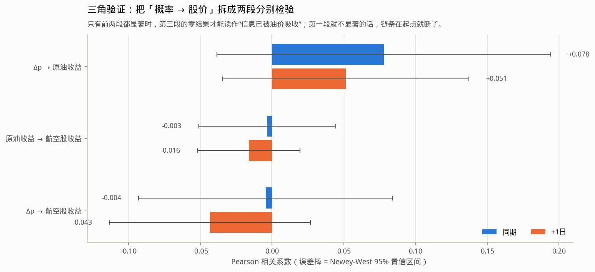

直接检验「概率 → 航空股」有个致命的解释困难：结果为零时分不清是**Polymarket 没信息**还是**燃油成本渠道不通**。所以拆成两段分别验。

| 链路 | 口径 | n | pearson | se_nw | t_nw | p_nw | spearman |
|---|---|---|---|---|---|---|---|
| Δp → 原油收益 | 同期 | 347 | 0.07793 | 0.05939 | 1.312 | 0.1895 | 0.1469 |
| Δp → 原油收益 | +1日 | 346 | 0.05133 | 0.04372 | 1.174 | 0.2403 | 0.001633 |
| 原油收益 → 航空股收益 | 同期 | 5376 | -0.003326 | 0.02436 | -0.1365 | 0.8914 | -0.02517 |
| 原油收益 → 航空股收益 | +1日 | 5376 | -0.01621 | 0.01821 | -0.8901 | 0.3734 | -0.01587 |
| Δp → 航空股收益 | 同期 | 354 | -0.004395 | 0.04519 | -0.09726 | 0.9225 | -0.01387 |
| Δp → 航空股收益 | +1日 | 354 | -0.0433 | 0.03577 | -1.211 | 0.2261 | -0.07815 |

### 3.5 分化检验（主要的伪发现防线）

真实油价冲击的教科书特征是**分化**：能源涨、航空跌，价差走阔。如果 Δp 上升时两者只是同涨同跌，说明测到的是全局风险偏好，不是油价。下表是 `能源收益 − 航空收益` 对 Δp 的相关。

| 口径 | n | pearson | se_nw | t_nw | p_nw | spearman |
|---|---|---|---|---|---|---|
| 同期 | 353 | 0.04343 | 0.04799 | 0.9051 | 0.3654 | 0.07921 |
| +1日 | 353 | 0.06612 | 0.03481 | 1.9 | 0.05748 | 0.08554 |

### 3.6 预测回归（控制大盘）

| 信号 | 标的 | n | beta | t_NW | beta_控制大盘 | t_NW_控制大盘 |
|---|---|---|---|---|---|---|
| dp | 美股航空（等权） | 354 | -0.01222 | -1.211 | -0.01045 | -1.162 |
| dp | 美股能源 | 353 | 0.006557 | 1.133 | 0.007683 | 1.479 |
| dp | 美股大盘 | 354 | 0.00149 | 0.4282 | 0.002192 | 0.6311 |
| dp | JETS航空ETF | 354 | -0.006005 | -0.906 | -0.004687 | -0.8031 |
| dp_norm | 美股航空（等权） | 287 | -0.001206 | -0.8123 | -0.000999 | -0.8042 |
| dp_norm | 美股能源 | 286 | -0.0002178 | -0.366 | -9.997e-05 | -0.2074 |
| dp_norm | 美股大盘 | 287 | -0.0001872 | -0.3614 | -0.0001107 | -0.259 |
| dp_norm | JETS航空ETF | 287 | -0.001167 | -1.034 | -0.001015 | -1.065 |
| ofi_share | 美股航空（等权） | 358 | -0.0009737 | -0.3282 | -0.001132 | -0.3871 |
| ofi_share | 美股能源 | 357 | -0.0003886 | -0.2591 | -0.0004935 | -0.3394 |
| ofi_share | 美股大盘 | 358 | -0.0003638 | -0.3061 | -0.0004275 | -0.3649 |
| ofi_share | JETS航空ETF | 358 | -0.001285 | -0.5556 | -0.001403 | -0.6165 |

### 3.7 稳健性：缩尾

主结果**不缩尾**。这里把 Δp 与收益各双侧缩尾 0.5% 后重算：若关联在缩尾后消失，结论要改写成「效应只存在于极端事件日」，而不是报一个全样本相关。

| 标的 | n | pearson | se_nw | t_nw | p_nw | spearman |
|---|---|---|---|---|---|---|
| 美股航空（等权） | 354 | -0.05351 | 0.03646 | -1.468 | 0.1421 | -0.07822 |
| 美股能源 | 353 | 0.04459 | 0.04464 | 0.9989 | 0.3179 | 0.0587 |
| 美股大盘 | 354 | 0.01944 | 0.03871 | 0.5021 | 0.6156 | 0.0433 |
| JETS航空ETF | 354 | -0.03489 | 0.03241 | -1.076 | 0.2817 | -0.05902 |
| WTI原油 | 346 | 0.05551 | 0.04671 | 1.188 | 0.2347 | 0.001628 |

## 4. 横截面 IC（本项目主指标口径）

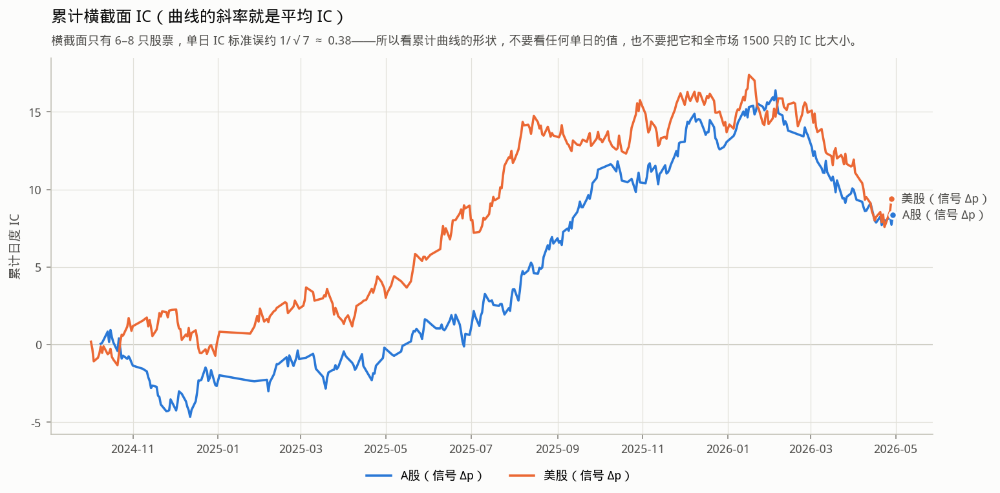

一个对所有股票都相同的宏观数，其横截面标准差为 0，对截面排序的贡献**恰为零**。所以打分必须是 `−β_i × Δp`：β_i 是个股对原油收益的滚动暴露度（只用过去 120 天，`shift(1)` 后再滚动，不含未来信息），负号让「分高 = 预期收益高」。

曲线的**斜率**就是平均 IC。一条稳定向上的直线说明信号一直有效；某个区间陡升、其余走平，说明 IC 均值为正只是某几天的一次性贡献，那不是可用的信号。

| 市场 | 信号 | n_days | mean_xs_width | ic_mean | ic_std | icir | t_nw | p_nw | ic_win_rate | ric_mean |
|---|---|---|---|---|---|---|---|---|---|---|
| A股 | dp | 330 | 8 | 0.02534 | 0.4371 | 0.05797 | 1.048 | 0.2949 | 0.503 | 0.008867 |
| A股 | dp_norm | 263 | 8 | 0.02525 | 0.4313 | 0.05853 | 0.8959 | 0.3703 | 0.5057 | 0.0009043 |
| A股 | ofi_share | 343 | 8 | 0.0104 | 0.4351 | 0.02391 | 0.4689 | 0.6391 | 0.5015 | 0.01928 |
| 美股 | dp | 351 | 6 | 0.02679 | 0.4692 | 0.05709 | 1.056 | 0.2908 | 0.5299 | 0.01278 |
| 美股 | dp_norm | 277 | 6 | 0.06063 | 0.4682 | 0.1295 | 2.087 | 0.03689 | 0.5596 | 0.04012 |
| 美股 | ofi_share | 358 | 6 | 0.02269 | 0.4728 | 0.04798 | 0.881 | 0.3783 | 0.5084 | -0.01101 |

### 4.1 这个 IC 只用到 Δp 的符号（一个必须先知道的恒等式）

Pearson 相关对其中一个变量的正仿射变换不变，而 Δp_t 对当天所有股票是**标量**，所以

> IC_t = corr(−β·Δp_t, r_t) = sign(−Δp_t) × corr(β, r_t)

也就是说 **|Δp| 被完全丢掉了**：Δp = +0.50 与 Δp = +0.03 给出一模一样的 IC。这不是实现瑕疵，是「宏观序列 × 个股暴露度」这种构造的固有性质，但它把 §4 检验的命题缩窄成了一句很具体的话——**「供给风险上升的日子里，高油价暴露的航空股是否跑得更差」**。消息的**大小**不在这个口径里，那部分证据在 §2/§3 的时序相关与事件研究里（那两处用的是 Δp 的数值本身）。

代码里对这个恒等式做了运行时断言（偏差 > 1e-9 直接抛错），所以下面的符号置换检验不是凭推导写的捷径，是有自检的。

### 4.2 安慰剂对照：IC 里到底有没有 Polymarket 的功劳

既然排序的**形状**完全由 β_i 决定、Δp 只定**符号**，就有一条很容易混进来的假阳性路径：若样本期内「低油价暴露的航空股跑得更好」本身成立（一个与预测市场无关的截面异象），而 Δp 又碰巧多数为正，IC 就会显著为正，但功劳一点也不属于 Polymarket。

**对照一：beta_only。**打分 = `−β_i`，完全不含 Polymarket 信息。它显著就说明 IC 来自 β 异象。它与主口径在**逐格相同**的样本上评——两行的 `mean_xs_width` 必须一致；不掩码的话它会一路摊到 Polymarket 还没有这个市场的年份上（样本从 288 天涨到 2361 天），「不显著」就分不清是真没信号还是被稀释掉了。

| 市场 | 打分 | n_days | mean_xs_width | ic_mean | ic_std | icir | t_nw | p_nw | ic_win_rate | ric_mean |
|---|---|---|---|---|---|---|---|---|---|---|
| A股 | 主口径 −β·Δp | 330 | 8 | 0.02534 | 0.4371 | 0.05797 | 1.048 | 0.2949 | 0.503 | 0.008867 |
| A股 | beta_only（打分 = −β，不含 Polymarket 信息） | 339 | 8 | 0.003693 | 0.4359 | 0.008474 | 0.1599 | 0.873 | 0.5044 | -0.00435 |
| 美股 | 主口径 −β·Δp | 351 | 6 | 0.02679 | 0.4692 | 0.05709 | 1.056 | 0.2908 | 0.5299 | 0.01278 |
| 美股 | beta_only（打分 = −β，不含 Polymarket 信息） | 354 | 6 | -0.002431 | 0.4726 | -0.005144 | -0.1132 | 0.9099 | 0.4689 | -0.00113 |

**对照二：符号置换检验。**把 Δp 的符号在**同一批交易日之间**随机打乱（β 不动，样本一天不变），重复 2000 次，看实测 t 值在置换零分布里的位置。这比单次打乱可靠得多：单次打乱只是零分布里的一个抽样点，小样本下它自己就可能偶然显著。

注意打乱必须**限定在进入检验的那批日子内部**。直接对整条 Δp 做置换会把有效值扔到 β 还没滚满 120 天的早期日子上，样本从 288 天掉到 23 天，然后在 23 天上给出一个 t = 2.9 的假显著——这个坑本轮踩过一次。

| 市场 | n_perm | n_days | ic_mean_实测 | t_NW_实测 | ic_mean_置换均值 | t_NW_置换_p5 | t_NW_置换_p95 | p_置换_双侧 |
|---|---|---|---|---|---|---|---|---|
| A股 | 2000 | 330 | 0.02534 | 1.048 | -0.0009539 | -1.699 | 1.628 | 0.3053 |
| 美股 | 2000 | 351 | 0.02679 | 1.056 | -0.0007479 | -1.728 | 1.516 | 0.2894 |

判据：主口径显著、**且** beta_only 不显著、**且** 置换 p 值显著，§4 的结论才成立。任一条不满足，结论要降级成「IC 由横截面 β 异象驱动，与预测市场无关」。

## 5. 行权价阶梯：直接的「油价预期」（21 个交易日）

到期 `end-of-march`　|　提取质量按 美股 口径报　|　可用 21/21 个交易日

### 5.1 阶梯在问什么（读图之前必须先弄清的一件事）

`will-crude-oil-cl-hit-high-K-by-T` 的赔付条件是「到 T 之前 WTI **触碰过** K」，所以整条曲线 `S(K) = P(期间最高价 ≥ K)` 还原的是**期间最高价**的分布，不是到期价的分布。这不是措辞讲究：`K50`（市场认为五成机会摸到的价位）因此系统性地**高于**当时的现货价，图上那条虚线一直压在油价线上方，是对的，不是错位。

由无套利，`S(K)` 必须随 K 非增（能摸到 110 就一定摸到过 100）。报价违反这一条时用**成交额加权的保序回归（PAVA）**修正，不用 `cummin`——后者把全部违反量都摊给高行权价那一侧，而违反究竟出在哪一侧是未知的。本轮最大违反量 0.0010。

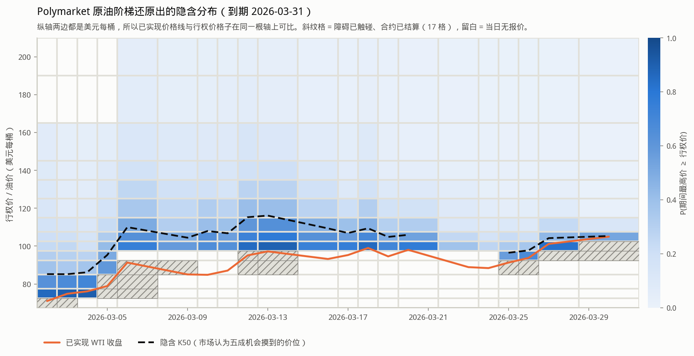

斜纹格 = **障碍已触碰、合约已结算**。障碍一旦触碰就立即结算并被钉在 0.999，此后不再含任何前瞻信息，它的日变动是假跳变，必须剔除。**只有上侧有这个阈值（p ≥ 0.99），下侧没有**：障碍型合约在到期前不可能裁定 No，所以 p ≤ 0.01 是一个货真价实的深度虚值报价（现货 90 时「摸到 200」的确该报 0.004），加个下界会把正常报价当成结算剔掉——这个坑本轮踩过一次，后果是把网格从 9 个行权价打到 3 个，积分区间从 100 美元宽缩到 20 美元宽，而那种缩窄读起来像是「市场预期的油价在下降」。

### 5.2 三道提取校验（这一节是在验代码，不是在报结论）

还原出来的分布对不对，有三个**相互独立**的验法，都必须过：

**（a）拿实际结算结果验吸收口径。**目录里有每个市场的 `winning_outcome_label`：结算为 Yes 的行权价必须在到期前被钉住过，结算为 No 的必须从未被钉住。本轮 **0/14 例不一致**——阈值 0.99 就是这条分界本身。

| K | won | ever_pinned | ok | note |
|---|---|---|---|---|
| 70 | Yes | True | True |  |
| 75 | Yes | True | True |  |
| 80 | Yes | True | True |  |
| 90 | Yes | True | True |  |
| 95 | Yes | True | True |  |
| 100 | Yes | True | True |  |
| 105 | No | False | True |  |
| 110 | No | False | True |  |
| 120 | No | False | True |  |
| 130 | No | False | True |  |
| 140 | No | False | True |  |
| 150 | No | False | True |  |
| 180 | No | False | True |  |
| 200 | No | False | True |  |

**（b）拿已实现油价验障碍不变式。**被钉住的最高行权价必须 ≤ 期间已实现最高价。本轮硬违反 1 天、边界 4 天。反方向（已实现价越过了某个行权价、而它没被钉住）只记作 `borderline` 不判错：CL 连续合约不是阶梯的参照合约，两者差一个换月基差。

**（c）重挂检查。**同一个行权价会被重新挂牌（油价回落到障碍下方时），于是同一天同一个 K 可能有多个 `condition_id`。本轮同日重叠 **0 例**，所以「按 K 取末笔」是唯一解。

**（d）信号 vs 已实现 WTI 收益。**这一条同样是**校验而不是发现**：阶梯是油价的衍生品，隐含分布的日变动与当日油价收益本来就该高度相关，**不高才说明还原错了**。

| 信号 | 标的 | n | pearson | spearman | p_perm | detectable_r |
|---|---|---|---|---|---|---|
| d_p_at_K | WTI 收益（提取正确性检验） | 16 | 0.8001 | 0.7706 | 0.0002 | 0.651 |
| d_K50 | WTI 收益（提取正确性检验） | 15 | 0.7484 | 0.6321 | 0.00105 | 0.6689 |
| d_exp_exceed | WTI 收益（提取正确性检验） | 13 | 0.8222 | 0.8077 | 0.0007 | 0.7094 |

### 5.3 为什么这里不用 Newey-West t 值，改用置换检验

`assoc.corr_with_t` 在 `n < 20` 时直接返回 NaN，这个下限是对的，**本节不降低它**：HAC 标准误在二十来个观测上不可靠，硬算出来的 t 值名义显著性是假的。替代方案是两件事配套使用——

1. **置换检验**（20,000 次，配对随机打乱）。经验 p 用 `(1 + #{|r_perm| ≥ |r_obs|}) / (1 + n_perm)`，分子上那个 +1 保证 p 严格大于 0：只跑了有限次置换，支撑不了「零假设下绝不可能」。

2. **自相关诊断**。置换检验的零假设含「观测可交换」，两列都是变动量时这大致成立，但必须测出来放在结论旁边。这张表测的是**本窗口内**的自相关，不是全历史——喂全历史进去会得到 n 上万的诊断，那说的是另一个样本。

| 序列 | n | rho_1 | rho_2 | rho_3 | LB_Q | LB_p |
|---|---|---|---|---|---|---|
| d_p_at_K | 19 | -0.02372 | -0.008614 | -0.1019 | 0.2731 | 0.965 |
| d_K50 | 17 | -0.02622 | -0.1053 | -0.162 | 0.8583 | 0.8355 |
| d_exp_exceed | 15 | -0.2447 | -0.02219 | -0.2014 | 1.962 | 0.5804 |
| 航空等权收益 | 21 | 0.08947 | -0.03785 | -0.226 | 1.6 | 0.6593 |
| WTI 收益 | 18 | -0.02365 | 0.007029 | -0.0144 | 0.01793 | 0.9994 |

### 5.4 A股：同期相关

截断 07:00 UTC　|　信号 21 个交易日　|　固定网格 100、110、120、150 美元/桶

_两件与 A 股口径有关的事，读数之前先说清。_

_其一，**网格更窄**。行权价能不能进固定网格看的是覆盖率 ≥ 80%，而覆盖率是在该市场自己的截断口径下算的：A 股截到 07:00 UTC，落在这个窗口里的末笔报价更少，于是只有 4 个行权价够格。`exp_exceed` 的积分域因此与美股那一遍不同，两边的该列**不可比大小**，只能各自看符号与显著性。_

_其二，A 股的「同期」本身就含一段真实的时滞：第 d 个交易日的信号窗口是 `(d-1 日 07:00 UTC, d 日 07:00 UTC]`，它**覆盖了前一个美国交易时段的全部消息**，而截断点正是北京时间 15:00 收盘。所以这不是前视，但它也不是美股那种严格意义上的同时刻共动。_

| 信号 | 标的 | n | pearson | spearman | p_perm | detectable_r |
|---|---|---|---|---|---|---|
| d_p_at_K | 航空等权 | 20 | -0.5824 | -0.4632 | 0.00835 | 0.5912 |
| d_p_at_K | SH600029 | 20 | -0.6701 | -0.5158 | 0.0011 | 0.5912 |
| d_p_at_K | SH600115 | 20 | -0.603 | -0.4917 | 0.0059 | 0.5912 |
| d_p_at_K | SH600221 | 20 | -0.4832 | -0.4668 | 0.0335 | 0.5912 |
| d_p_at_K | SH601021 | 20 | -0.6066 | -0.4977 | 0.00585 | 0.5912 |
| d_p_at_K | SH601111 | 20 | -0.6511 | -0.4767 | 0.0024 | 0.5912 |
| d_p_at_K | SH601156 | 20 | -0.2377 | -0.2399 | 0.312 | 0.5912 |
| d_p_at_K | SH603885 | 20 | -0.4652 | -0.4692 | 0.04375 | 0.5912 |
| d_p_at_K | SZ002928 | 20 | -0.5141 | -0.4391 | 0.0224 | 0.5912 |
| d_K50 | 航空等权 | 18 | -0.4722 | -0.2528 | 0.0525 | 0.619 |
| d_K50 | SH600029 | 18 | -0.5907 | -0.2962 | 0.01 | 0.619 |
| d_K50 | SH600115 | 18 | -0.5104 | -0.3725 | 0.0319 | 0.619 |
| d_K50 | SH600221 | 18 | -0.3193 | -0.2658 | 0.1905 | 0.619 |
| d_K50 | SH601021 | 18 | -0.6554 | -0.4076 | 0.0042 | 0.619 |
| d_K50 | SH601111 | 18 | -0.5736 | -0.2838 | 0.01115 | 0.619 |
| d_K50 | SH601156 | 18 | -0.03587 | -0.05266 | 0.8862 | 0.619 |
| d_K50 | SH603885 | 18 | -0.4333 | -0.2962 | 0.0755 | 0.619 |
| d_K50 | SZ002928 | 18 | -0.3342 | -0.2095 | 0.1723 | 0.619 |
| d_exp_exceed | 航空等权 | 20 | -0.5767 | -0.5053 | 0.00885 | 0.5912 |
| d_exp_exceed | SH600029 | 20 | -0.6846 | -0.5474 | 0.00085 | 0.5912 |
| d_exp_exceed | SH600115 | 20 | -0.5886 | -0.5504 | 0.0065 | 0.5912 |
| d_exp_exceed | SH600221 | 20 | -0.4449 | -0.494 | 0.05145 | 0.5912 |
| d_exp_exceed | SH601021 | 20 | -0.6823 | -0.612 | 0.00135 | 0.5912 |
| d_exp_exceed | SH601111 | 20 | -0.6089 | -0.4707 | 0.00465 | 0.5912 |
| d_exp_exceed | SH601156 | 20 | -0.1967 | -0.2445 | 0.4012 | 0.5912 |
| d_exp_exceed | SH603885 | 20 | -0.4769 | -0.612 | 0.0419 | 0.5912 |
| d_exp_exceed | SZ002928 | 20 | -0.4982 | -0.4842 | 0.02685 | 0.5912 |

**A股最强的一列是 `d_p_at_K`**：r=-0.582，置换 p=0.00835，n=20；按 3 个信号列做 Bonferroni 校正后 p=0.02505（仍然显著）。校正是必须的：三列信号都是从同一条隐含分布上读出来的，报最强那一列而不校正就是在挑显著。逐只个股那些行是**支持性证据**而不是另外 6 个独立命题，所以不并入这里的校正。

_注意 |r|=0.582 落在该样本量的可检出下限 0.591 **之下**。这不矛盾：可检出下限说的是「效应真有这么大时能有 80% 概率测出来」，而 p 值说的是「零假设下出现这么大的 r 有多罕见」。两句话同时成立的读法是：这个关联报出来了，但功效不足，复现率不会高。_

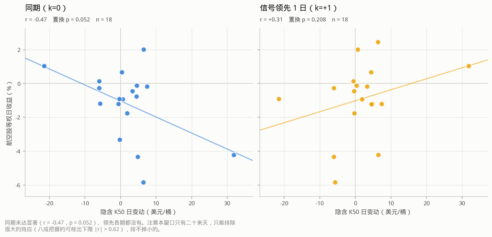

散点不是装饰：n≈18 的相关系数完全可能由一两个极端点撬出来，而「十几个点排成一条线」的 r 和「一个远点把回归线拽过去」的 r 是完全不同的证据。两个分面共享坐标范围，否则 `k=+1` 那张会被自动缩放拉满，看起来和 `k=0` 一样有结构。

_图上画的是 `d_K50`（与下面的领先滞后扫描同一列，选它是因为量纲最直白），**不是**上面那段结论里的 `d_p_at_K`。所以图上的 r 与正文的 -0.582 本来就不该相等。_

领先滞后扫描（`k>0` = 信号领先收益，有预测价值；`k<0` = 收益领先信号，无增量）。**只扫 `d_K50` 这一列**，标的固定为航空等权：三列信号各扫一遍就是 21 次检验，校正后什么都不会剩，而扫哪一列必须在看结果之前定下来。选 `d_K50` 的理由是它量纲最直白（美元/桶），不是因为它最显著。

| k | n | pearson | p_perm | spearman | detectable_r | p_bonferroni |
|---|---|---|---|---|---|---|
| -3 | 18 | -0.1301 | 0.6047 | -0.1992 | 0.619 | 1 |
| -2 | 18 | -0.2019 | 0.4311 | -0.257 | 0.619 | 1 |
| -1 | 18 | 0.55 | 0.0225 | 0.3849 | 0.619 | 0.1575 |
| 0 | 18 | -0.4722 | 0.0525 | -0.2528 | 0.619 | 0.3675 |
| 1 | 18 | 0.3086 | 0.2081 | 0.195 | 0.619 | 1 |
| 2 | 18 | 0.07165 | 0.7731 | 0.2838 | 0.619 | 1 |
| 3 | 18 | 0.01219 | 0.9618 | 0.05882 | 0.619 | 1 |

**读法**：Bonferroni 校正后显著的 k = （无）；仅原始 p<0.05、校正后不显著的 k = [-1]（扫 7 个 k，零假设下出现这种情形本属常事，**不能**拿来当领先性的证据）。`k=0` 处 r=-0.472、Bonferroni p=0.367。没有任何 k 通过校正，包括同期项。注意 n=18 下 80% 功效的可检出下限是 |r|≈0.619，所以这只排除了**大的**领先效应，排不掉小的。

### 5.5 A股：窗口累计收益（主要的伪发现防线）

油价冲击的特征形态是**分化**：能源涨、航空跌。若三者同向下跌，那就只是风险偏好恶化，此时再高的相关系数也不能解读成「油价预期影响航空股」。

| 资产 | 类别 | 累计收益% |
|---|---|---|
| 航空等权（8 只） | 航空 | -18.12 |
| SH600029 | 航空 | -21.93 |
| SH600115 | 航空 | -24.08 |
| SH600221 | 航空 | -14.12 |
| SH601021 | 航空 | -15.95 |
| SH601111 | 航空 | -18.55 |
| SH601156 | 航空 | -7.935 |
| SH603885 | 航空 | -14.38 |
| SZ002928 | 航空 | -27.32 |
| 能源等权 | 能源 | 3.002 |
| 沪深全A | 大盘 | -9.247 |

**分化成立**：能源 +3.0%、航空等权 -18.1%。能源涨而航空跌，是油价冲击的特征形态，不是普跌行情。

### 5.6 美股：同期相关

截断 20:00 UTC　|　信号 21 个交易日　|　固定网格 100、105、110、120、130、140、150、180、200 美元/桶

| 信号 | 标的 | n | pearson | spearman | p_perm | detectable_r |
|---|---|---|---|---|---|---|
| d_p_at_K | 航空等权 | 19 | -0.7976 | -0.7895 | 5e-05 | 0.6046 |
| d_p_at_K | AAL | 19 | -0.8005 | -0.7863 | 5e-05 | 0.6046 |
| d_p_at_K | ALK | 19 | -0.8097 | -0.7579 | 5e-05 | 0.6046 |
| d_p_at_K | DAL | 19 | -0.684 | -0.8053 | 0.001 | 0.6046 |
| d_p_at_K | JBLU | 19 | -0.5157 | -0.7439 | 0.0256 | 0.6046 |
| d_p_at_K | LUV | 19 | -0.7885 | -0.7614 | 5e-05 | 0.6046 |
| d_p_at_K | UAL | 19 | -0.8062 | -0.8298 | 5e-05 | 0.6046 |
| d_K50 | 航空等权 | 17 | -0.8617 | -0.9289 | 0.0001 | 0.6344 |
| d_K50 | AAL | 17 | -0.8665 | -0.8522 | 5e-05 | 0.6344 |
| d_K50 | ALK | 17 | -0.7594 | -0.8235 | 0.00045 | 0.6344 |
| d_K50 | DAL | 17 | -0.7731 | -0.8995 | 0.00035 | 0.6344 |
| d_K50 | JBLU | 17 | -0.6978 | -0.8529 | 0.0025 | 0.6344 |
| d_K50 | LUV | 17 | -0.8734 | -0.8358 | 5e-05 | 0.6344 |
| d_K50 | UAL | 17 | -0.8068 | -0.8382 | 0.00015 | 0.6344 |
| d_exp_exceed | 航空等权 | 15 | -0.8221 | -0.7321 | 0.0004 | 0.6689 |
| d_exp_exceed | AAL | 15 | -0.7676 | -0.725 | 0.001 | 0.6689 |
| d_exp_exceed | ALK | 15 | -0.7987 | -0.75 | 0.00055 | 0.6689 |
| d_exp_exceed | DAL | 15 | -0.7364 | -0.75 | 0.0019 | 0.6689 |
| d_exp_exceed | JBLU | 15 | -0.4787 | -0.6929 | 0.0644 | 0.6689 |
| d_exp_exceed | LUV | 15 | -0.8604 | -0.7821 | 0.0001 | 0.6689 |
| d_exp_exceed | UAL | 15 | -0.8417 | -0.8714 | 0.00015 | 0.6689 |

**美股最强的一列是 `d_K50`**：r=-0.862，置换 p=0.0001，n=17；按 3 个信号列做 Bonferroni 校正后 p=0.0003（仍然显著）。校正是必须的：三列信号都是从同一条隐含分布上读出来的，报最强那一列而不校正就是在挑显著。逐只个股那些行是**支持性证据**而不是另外 6 个独立命题，所以不并入这里的校正。

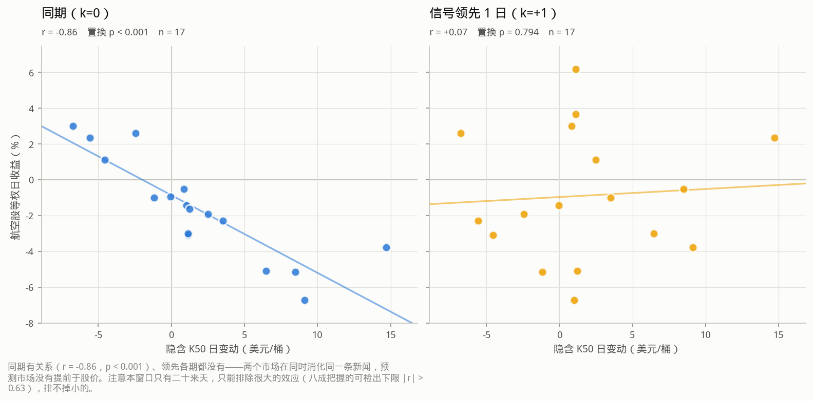

散点不是装饰：n≈18 的相关系数完全可能由一两个极端点撬出来，而「十几个点排成一条线」的 r 和「一个远点把回归线拽过去」的 r 是完全不同的证据。两个分面共享坐标范围，否则 `k=+1` 那张会被自动缩放拉满，看起来和 `k=0` 一样有结构。

领先滞后扫描（`k>0` = 信号领先收益，有预测价值；`k<0` = 收益领先信号，无增量）。**只扫 `d_K50` 这一列**，标的固定为航空等权：三列信号各扫一遍就是 21 次检验，校正后什么都不会剩，而扫哪一列必须在看结果之前定下来。选 `d_K50` 的理由是它量纲最直白（美元/桶），不是因为它最显著。

| k | n | pearson | p_perm | spearman | detectable_r | p_bonferroni |
|---|---|---|---|---|---|---|
| -3 | 17 | -0.01216 | 0.9633 | 0.06863 | 0.6344 | 1 |
| -2 | 17 | 0.2121 | 0.4176 | 0.2451 | 0.6344 | 1 |
| -1 | 17 | -0.2125 | 0.411 | 0.02206 | 0.6344 | 1 |
| 0 | 17 | -0.8617 | 0.0001 | -0.9289 | 0.6344 | 0.0007 |
| 1 | 17 | 0.06969 | 0.7936 | 0.07353 | 0.6344 | 1 |
| 2 | 17 | 0.1145 | 0.6577 | 0.04167 | 0.6344 | 1 |
| 3 | 17 | 0.1396 | 0.5991 | 0.2525 | 0.6344 | 1 |

**读法**：Bonferroni 校正后显著的 k = [0]。`k=0` 处 r=-0.862、Bonferroni p=0.001。唯一显著的是同期项，且 |k|≥1 大致关于 0 对称——这是**同期共动**，不是领先：两个市场在同时消化同一条新闻，预测市场没有跑在股价前面。注意 n=17 下 80% 功效的可检出下限是 |r|≈0.634，所以这只排除了**大的**领先效应，排不掉小的。

### 5.7 美股：窗口累计收益（主要的伪发现防线）

油价冲击的特征形态是**分化**：能源涨、航空跌。若三者同向下跌，那就只是风险偏好恶化，此时再高的相关系数也不能解读成「油价预期影响航空股」。

| 资产 | 类别 | 累计收益% |
|---|---|---|
| 航空等权（6 只） | 航空 | -22.2 |
| AAL | 航空 | -22.11 |
| ALK | 航空 | -33.74 |
| DAL | 航空 | -3.82 |
| JBLU | 航空 | -25.63 |
| LUV | 航空 | -26.33 |
| UAL | 航空 | -19.84 |
| XLE | 能源 | 10.8 |
| JETS | 航空ETF | -16.91 |
| SPY | 大盘 | -7.875 |

**分化成立**：能源 +10.8%、航空等权 -22.2%。能源涨而航空跌，是油价冲击的特征形态，不是普跌行情。

## 6. 口径与已知局限（逐条）

| 项 | 处理 | 偏差方向 |
|---|---|---|
| 盘口深度数据仅 64 天 | 改用成交口径的 OFI 作方向压力代理 | 代理不如真深度，效应向零偏 |
| 美股日线**未复权** | DAL/LUV 每季一个约 −0.5% 的除息跳空 | 与油价概率无关的噪声进分母，相关系数向零偏（保守） |
| 原油为**连续合约** | 换月跳空按 \|r\|>8% 剔除 | 少用约每月 1 天 |
| A 股截断 07:00 UTC | = 北京 15:00 收盘 | 无前视 |
| 美股截断 20:00 UTC | 冬令时 = 美东 15:00，比收盘早 1 小时 | 少用 1 小时信息（保守），绝不越过收盘线 |
| 概率水位 ffill | 上限 10 自然日，超过置 NaN | 不 bfill、不插值——那是把未来搬到过去 |
| 流量类因子（成交额/笔数/OFI） | 无成交 = 0，**不** ffill | ffill 会把一天的成交额复制成一周 |
| 横截面 6–8 只 | IC 照报，但标注单日 SE≈0.38 | 不可与全市场 1500 只的 IC 比大小 |
| 截面 IC 只用到 sign(Δp) | 恒等式见 §4.1，配 beta_only 与 2000 次符号置换两重对照 | 丢掉了消息大小，该部分证据看 §2/§3 |
| 11 次滞后扫描 | 报 Bonferroni 校正 p | 防挑最显著的 k |
| 阶梯样本仅 21 个交易日 | 不用 HAC t 值，改置换检验 + 自相关诊断 | n<20 的 HAC 名义显著性是假的 |
| 阶梯还原的是**期间最高价**分布 | K50 系统性高于现货，不作修正 | 不是错位；把它当到期价读才是错 |
| 障碍触碰后被钉在 0.999 | p≥0.99 判为已结算并剔除；**下侧无对应阈值** | 加下界会把深度虚值报价当结算剔掉 |
| 阶梯曲线的跨行权价插值 | 只在当日已观测的行权价区间**内**插，不外推 | 跨时间插值是前视，禁用 |
| `exp_exceed` 是个积分 | 只在当日覆盖**整个**固定网格时才出数 | 否则积分域一变，数字会因非经济原因移动 |
| `p_level` 高度自相关 | **不进**显著性表，只用于画图与事件定义 | 水位对收益回归是伪回归的经典形式 |

每张图旁边都有同名 CSV（表格视图）。这是强制的：调色板里 aqua/yellow 两槽对浅色底的对比度低于 3:1，规范要求有等价的非颜色读法；而「图里那个峰值到底是多少」这种问题，图本身永远答不了。
